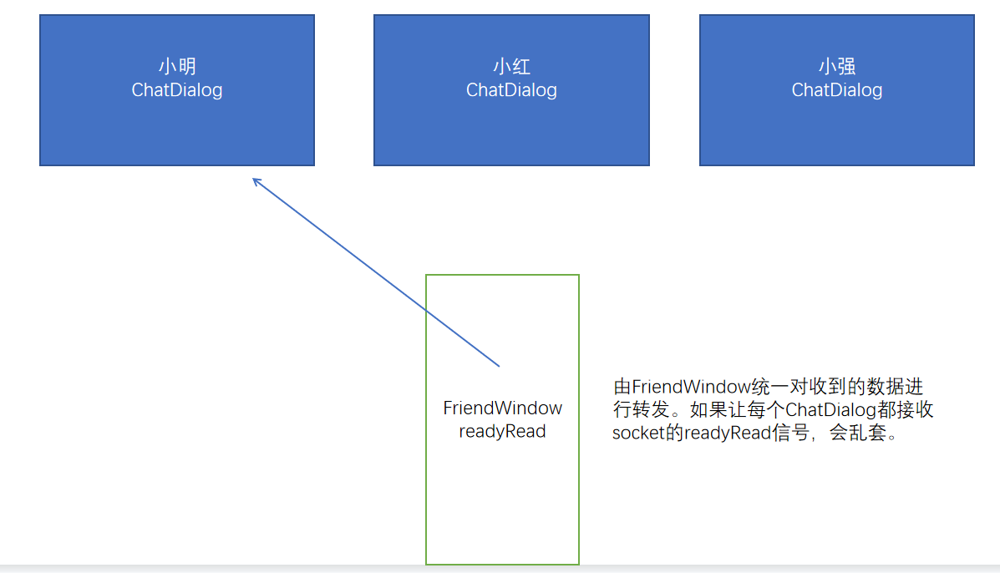
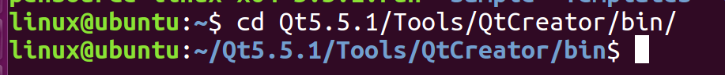
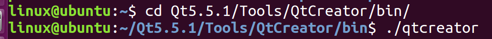
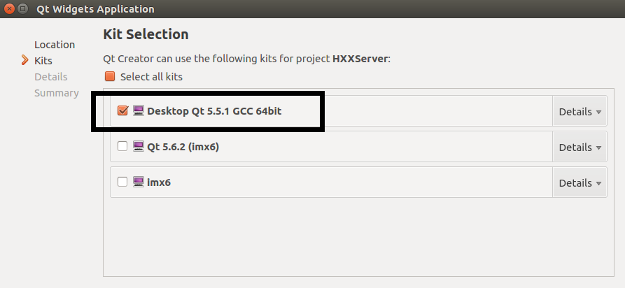
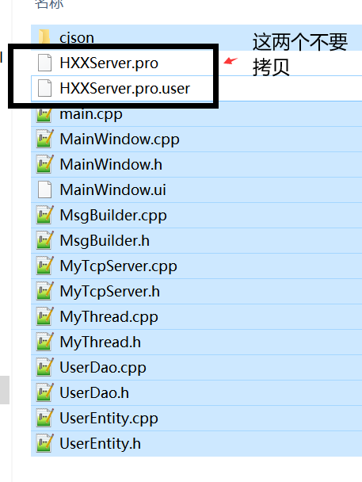
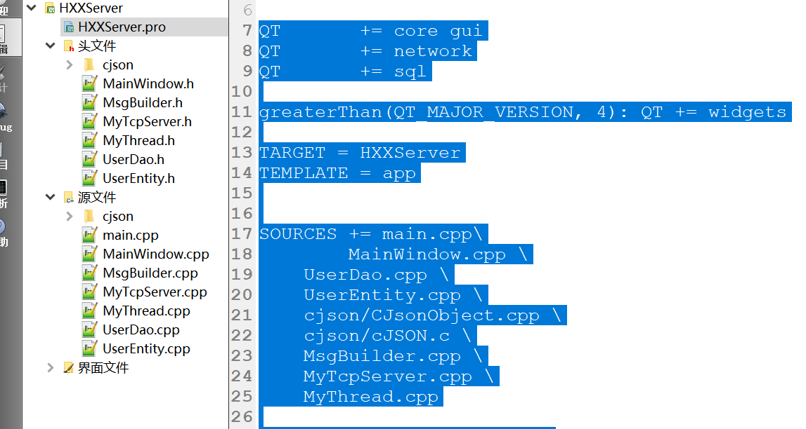
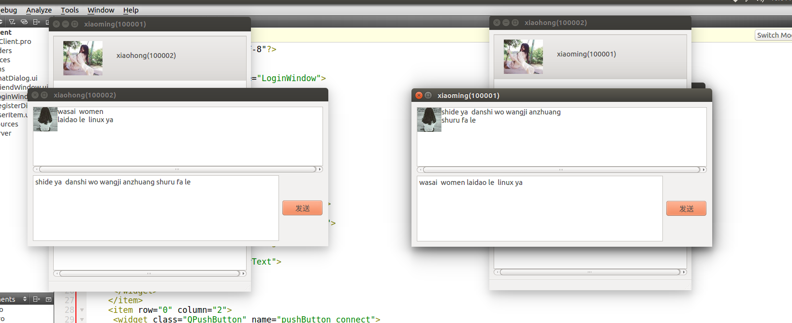
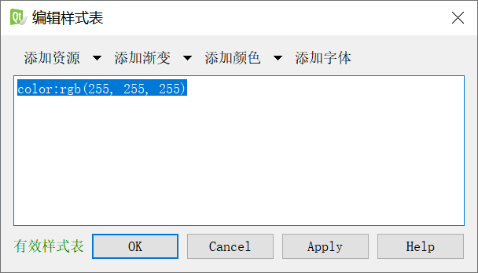

# 项目步骤10：

实现私聊信息的发送和接收

# 项目步骤11：

移植到linux

Qt是跨平台的框架，只需要把在windows上写的代码，移植（拷贝）到linux的项目上就可以了。

1. 运行linux下的qtcreator

2. 创建server和client项目

3. 移植代码

拷贝pro文件的全部内容

# 项目步骤12：

保存未读信息并显示未读信息数量

只在客户端写功能就可以

当客户端收到信息时，如果窗口是打开的，直接显示；

如果窗口是关闭的呢？

用这个好友对应的UserItem对象保存未读的信息。

QStringList  qt为我们提供的存放字符串的数组。

