今天上全天，明天一上午，明天下午没有课

同学们上课互相拍照，截上课屏，个班班长统计一下今天晚上发给我。

周五一上午，下午答辩，我负责答疑。


# 项目步骤7：

客户端登录成功显示好友列表


## 知识点1：QListWidget控件

item是listwidget的一个条目

listwidget在双击item的时候，会发出一个信号

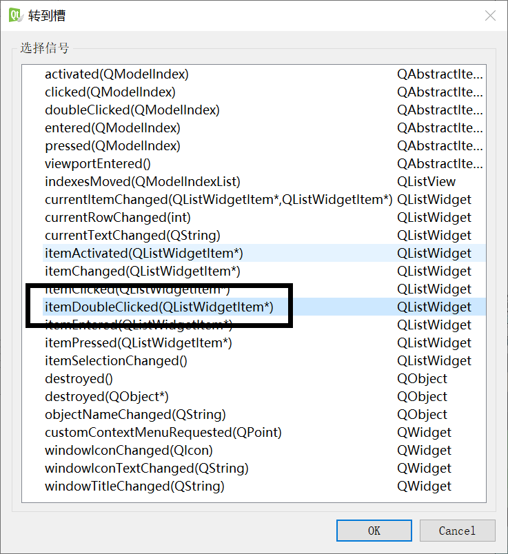

```C++
信号的QListWidgetItem *item参数，指向item对象，包含了这个条目的信息。
```


## 知识点2：自定义控件

常规的ListWidget默认显示字符串，可以显示更加复杂的信息，但是默认不支持。所以我们需要自定义控件让ListWidget显示。

自定义控件，一定要先继承Qt中的某个控件。如果Qt中所有的控件都不是我们想要的，那就继承QWidget。QWidget是所有控件的基类。

### 创建自定义控件

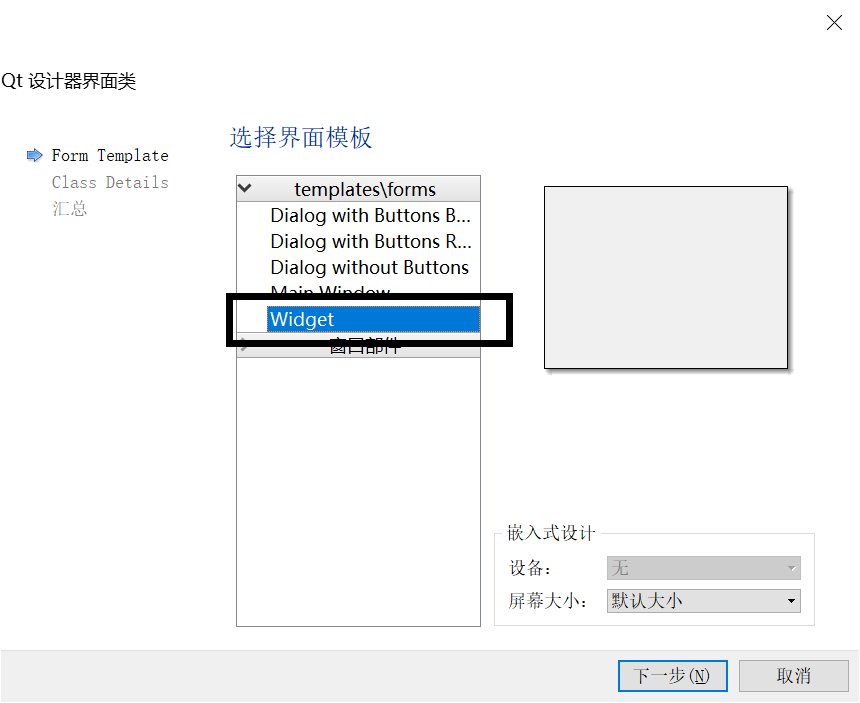

### 在QT项目中添加图片资源

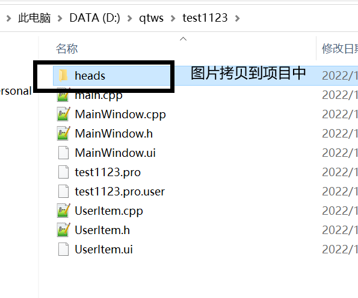

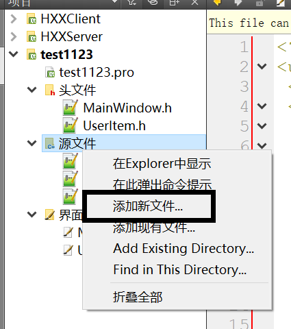

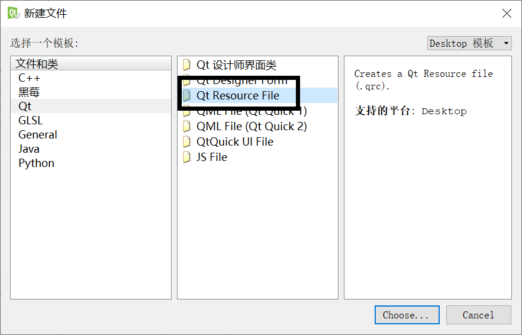

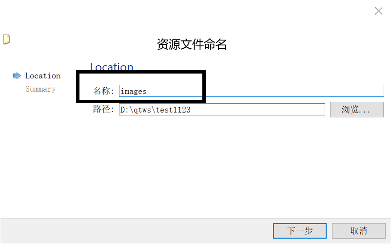

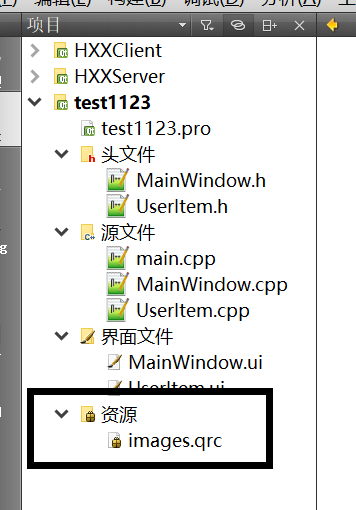


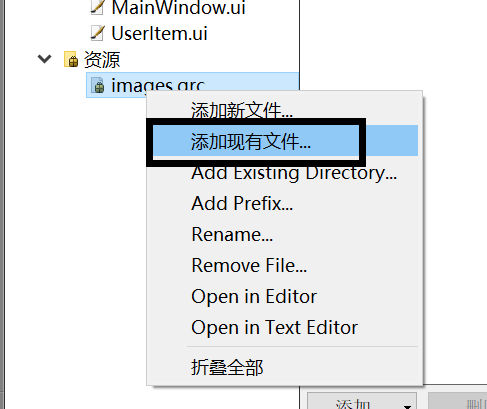


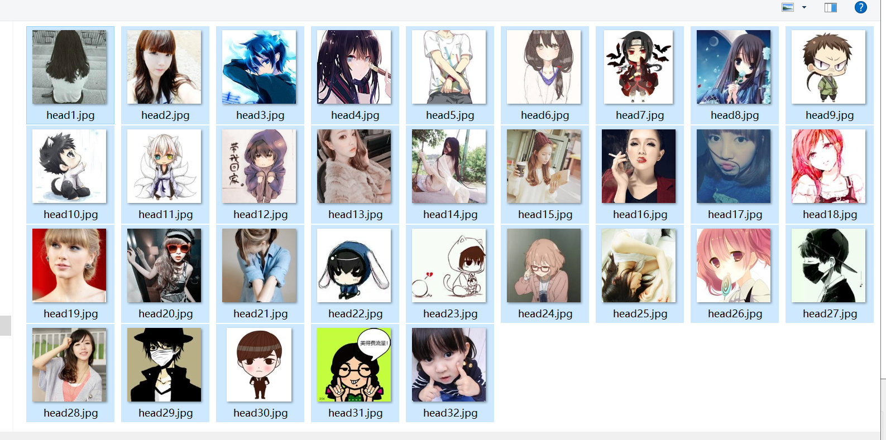

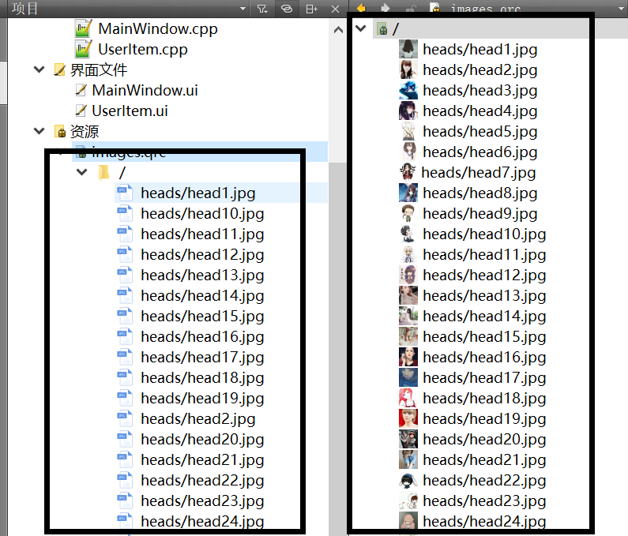


### QLabel显示图片

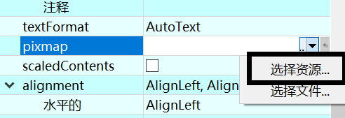


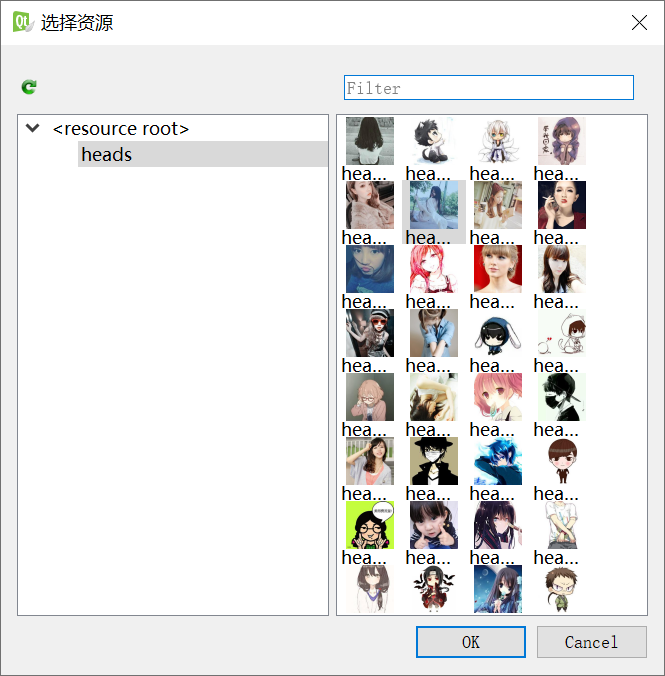

不能完全显示图片

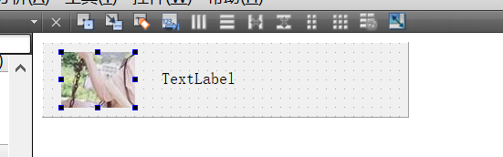


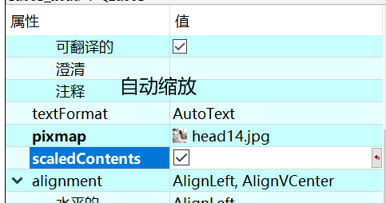


本次实训由于时间关系，我会把头像先写死，但是数据接口已经留好了（json和数据库），后期同学们只需要在ui上根据headId把头像加上就可以了。


### 使用QListWidget显示自定义控件

```C++
vector<QString> v;
v.push_back("小明");
v.push_back("小红");
v.push_back("小蓝");
v.push_back("小绿");
v.push_back("小紫");
v.push_back("小黄");

for(int i = 0;i < v.size();i++)
{
    UserItem* userItem = new UserItem(v[i]);//创建自定义控件对象
    //QListWidget默认是不能直接显示UserItem的，需要中介QListWidgetItem对象
    QListWidgetItem* item = new QListWidgetItem(ui->listWidget_friend);
    item->setSizeHint(userItem->size());//调整尺寸，和userItem一样大小
    ui->listWidget_friend->setItemWidget(item, userItem);//设置条目的控件
}
```


### QListWidget双击事件

为什么放在QListWidget中的控件是自定义的UserItem类型，而获得控件的时候却返回QWidget*呢？

为什么不返回UserItem*呢？因为在C++中基类类型的指针可以指向派生类类型的对象。

但是，基类类型的指针，不能调用派生类中额外定义的函数，只能调用派生类中重写的函数。

此时需要我们将QWidget\*转成UserItem\*。怎么转？不能使用强转，任何时候强转都不建议使用，因为不安全。

```C++
dynamic_cast<>();//专门用来将基类类型指针转换成派生类类型的指针，如果转换失败返回空指针。
```

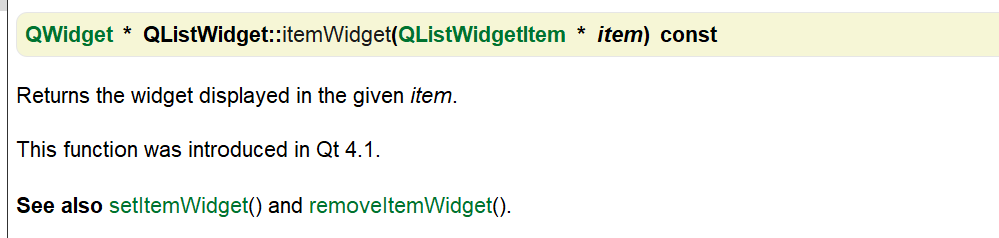


```C++
void MainWindow::on_listWidget_friend_itemDoubleClicked(QListWidgetItem *item)
{
    //获得与item绑定的UserItem控件对象
    QWidget* itemWidget = ui->listWidget_friend->itemWidget(item);
    //将基类类型指针转换成派生类类型的指针
    UserItem* userItem = dynamic_cast<UserItem*>(itemWidget);
    QMessageBox::information(this, "条目", userItem->getName());
}
```


# 项目步骤8：

客户端和服务端的用户上线下线

用户上线：

A先上线，B再上线，B中能显示A，但是A中不能显示B。

如果服务器不告诉A，A是不可能知道B上线的。所以上线功能，首先有发出消息。

当B上线的时候，服务器应该通知所有在线的用户，说B上线了。


用户下线：

A下线，只有服务器能知道A下线了，然后服务器要通知所有在线用户A下线了。

A的线程结束就算A下线了。

### 1. 在MyThread中添加信号

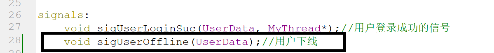

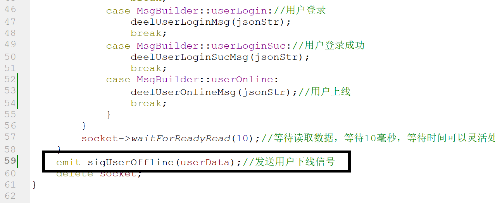


### 2. 在MyThread中添加成员变量

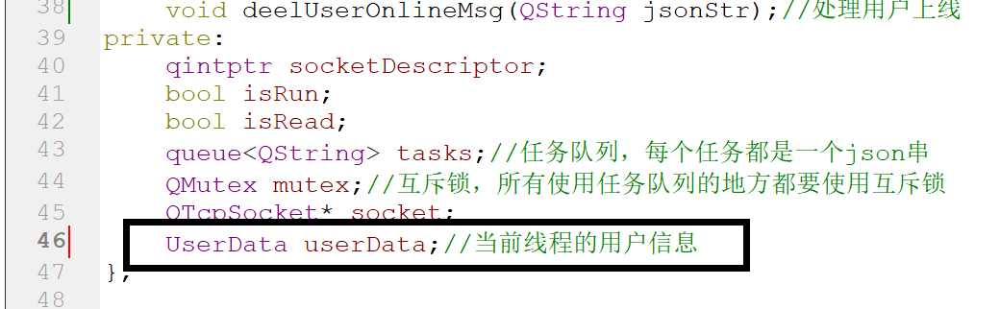

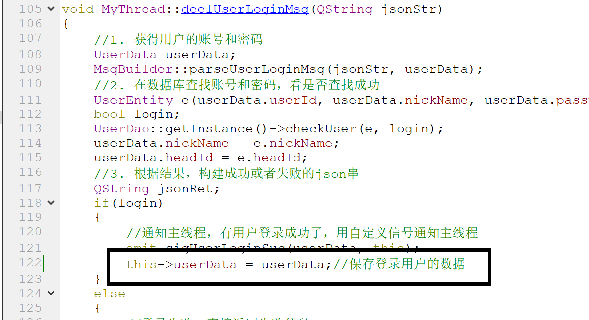


### 3. 主线程添加槽函数

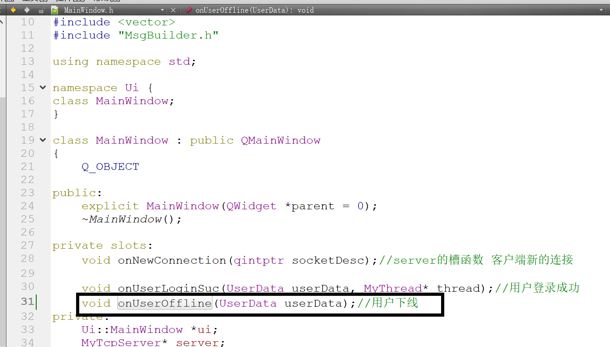


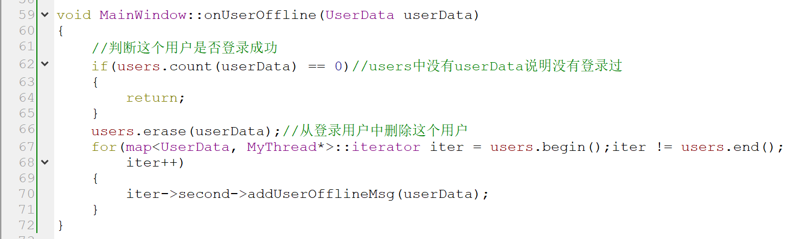

### 4.MsgBuilder添加用户下线在json

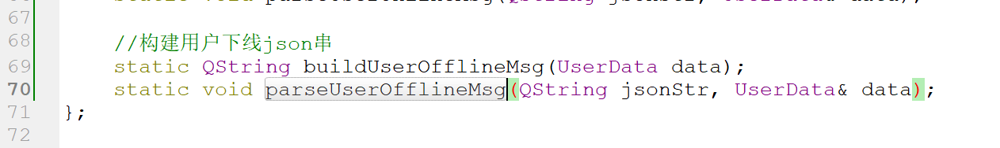

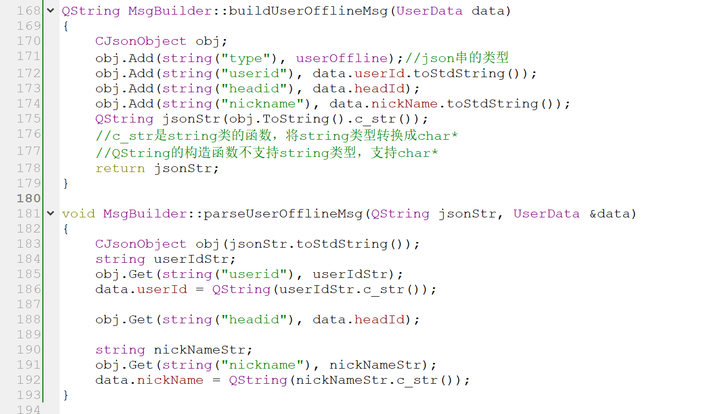

### 5. MyThread添加主线程调用和处理用户下线函数

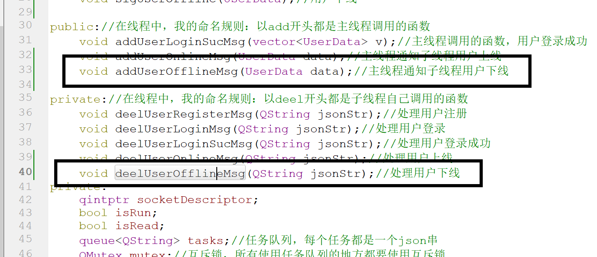

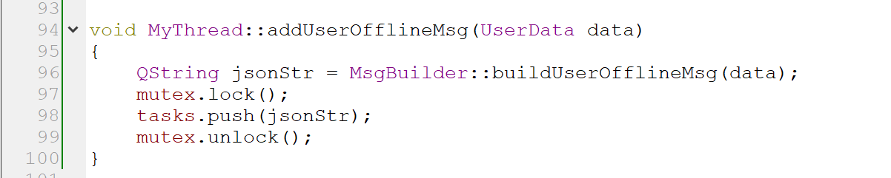

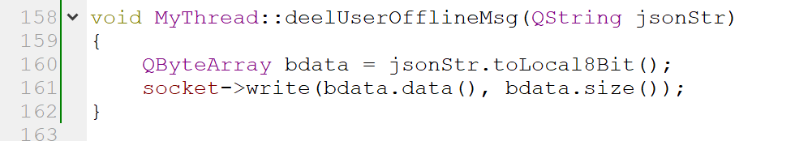

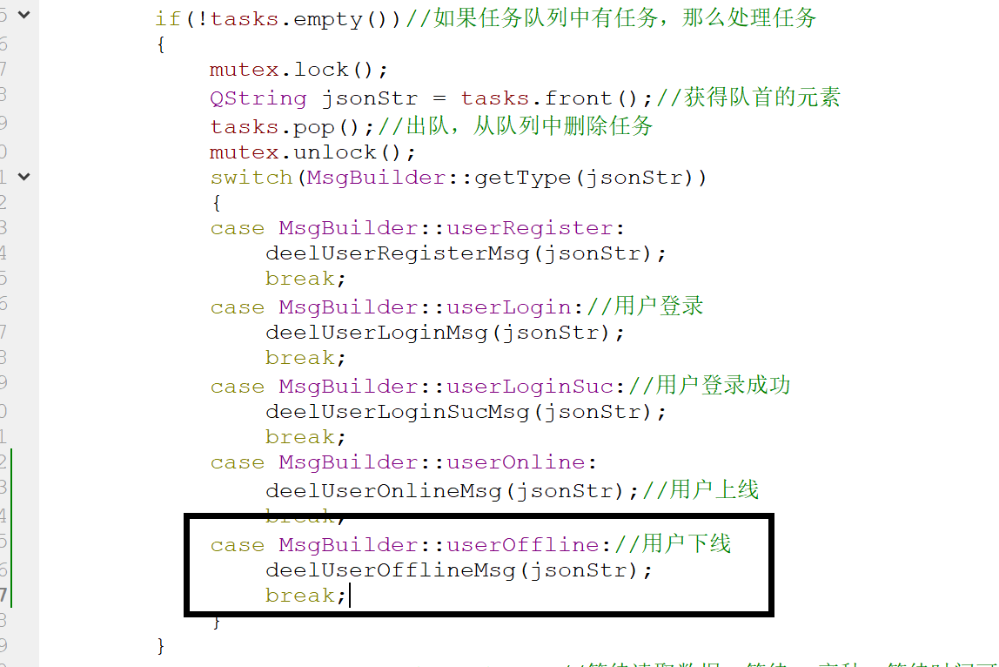


