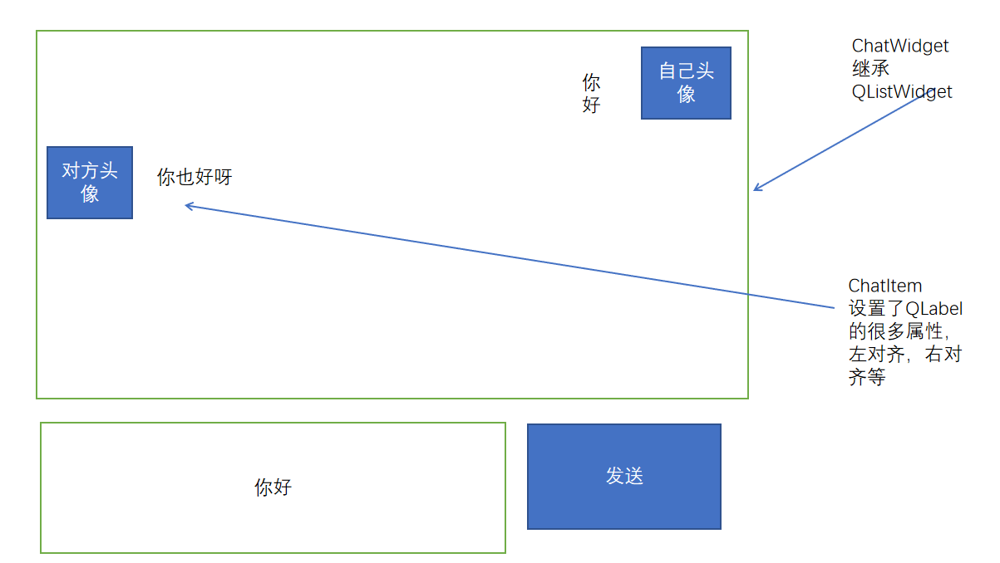

# 项目步骤8：

实现客户端和服务端的用户上线下线功能


在FriendWindow上显示当前用户的信息


# 项目步骤9：

双击好友，创建私聊界面




## 知识点1：动态添加控件

自定义的控件是不能通过界面文件添加的，只能使用代码添加。


```C++
QGridLayout* gridLayout = new QGridLayout(this);
setLayout(gridLayout);//给当前窗口设置成栅格布局，效果等同于在ui文件中设置布局

chatWidget = new ChatWidget(this);//创建自定义聊天控件
gridLayout->addWidget(chatWidget, 0, 0, 1, 2);//添加到栅格布局中，0 0位置，宽度2格，高度1格

//将ui文件中的文本编辑框添加到栅格布局中
gridLayout->addWidget(ui->textEdit, 2, 0, 1, 1);
//将ui文件中的发送按钮添加到栅格布局中
gridLayout->addWidget(ui->pushButton_send, 2, 1, 1, 1);
    
```


在弹出对话框的时候，有可能同时跟很多人聊天，也就是所同时可能会有很多对话框出现，所以我们需要对这些对话框进行管理。

```C++
map<UserData, ChatDialog*> dialogs;//用于管理每个好友对应的聊天窗口
```


